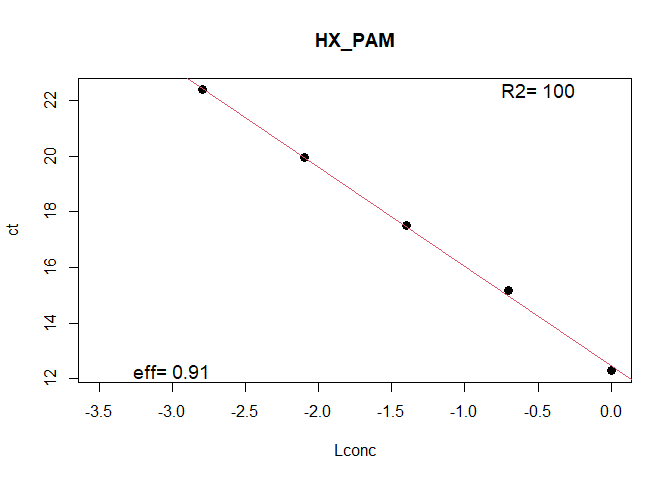
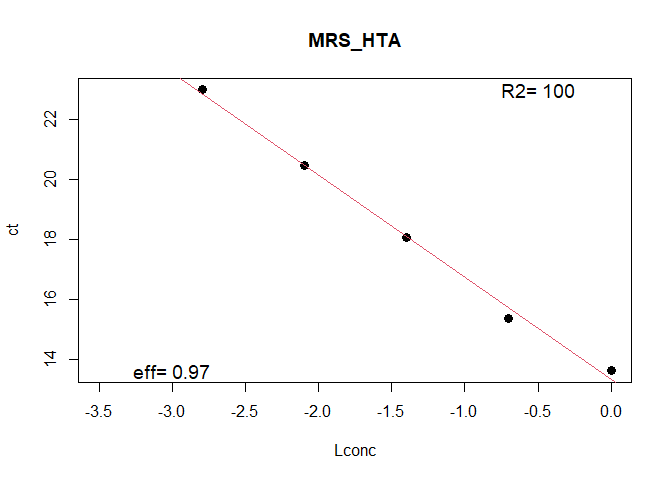
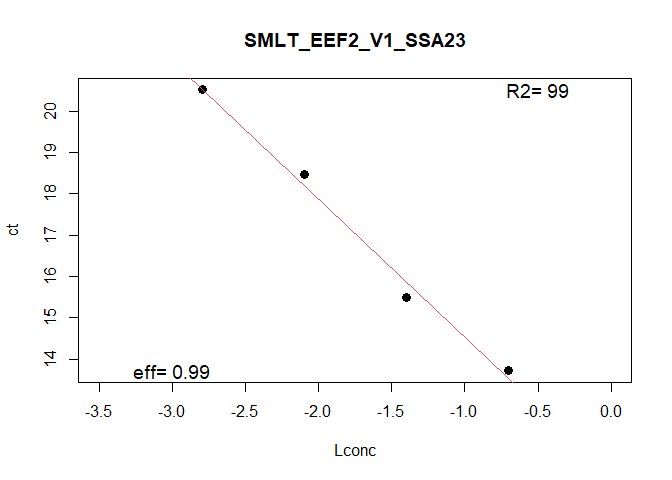

qPCR Efficiency Results
================
Shaorong
2025-05-06

## R Markdown

qPCR processing of gill hypoxia plate 5 for stats

``` r
dilut<- read.csv("dilut_plate5.csv",header=T,row.names=1)  #dilutions as rownames, 3 HK at front columns
#
Log10<- log10(c(0.0016,0.008,0.04,0.2,1))

##1. Efficiency

#stack into columns
eff1<- stack(dilut)
eff1$Lconc<- Log10
eff2<- eff1[,c(2,3,1)]; rm(eff1) #reorder columns
colnames(eff2)[c(1,3)]<- c("assay","ct")

#linear model
library(plyr) #required package
models <- dlply(eff2, "assay", function(df) 
  lm(ct ~ Lconc, data = df))

#information from the models
res<- ldply(models, function(x) {
  r.sq <- summary(x)$r.squared
  slope <- summary(x)$coefficients[2]
  data.frame(r.sq, slope) })

#efficiency calculation
res$efficiency<- 10^ -(1/res$slope) - 1
res<- res[,c(1,4,2,3)]  #reorder

#save results

write.csv(res,"eff_hypoxia_plate5.csv",row.names=F)

#Plots to check
res2<- levels(as.factor(eff2$assay))

for (i in 1:length(res2)){
  plot(ct~ Lconc, eff2[eff2$assay==res2[i],], xlim=c(-3.5,0),pch=16, cex=1.2, main=res2[i])
  mod<- lm(ct~ Lconc, eff2[eff2$assay==res2[i],])
  effi<- 10^ -(1/summary(mod)$coefficients[2]) -1
  abline(mod,col=2)
  text(-0.5, max(eff2[eff2$assay==res2[i],]$ct,na.rm=T),paste("R2=",round(100*summary(mod)$r.squared,0)),cex=1.2 )
  text(-3, min(eff2[eff2$assay==res2[i],]$ct,na.rm=T),paste("eff=",round(effi,2)),cex=1.2 )
}
```

<!-- --><!-- --><!-- --><!-- --><!-- --><!-- --><!-- --><!-- --><!-- --><!-- --><!-- --><!-- --><!-- --><!-- --><!-- --><!-- --><!-- --><!-- --><!-- --><!-- --><!-- --><!-- --><!-- --><!-- --><!-- --><!-- --><!-- --><!-- --><!-- --><!-- --><!-- --><!-- --><!-- --><!-- --><!-- --><!-- --><!-- --><!-- --><!-- --><!-- --><!-- --><!-- --><!-- --><!-- --><!-- --><!-- --><!-- --><!-- --><!-- --><!-- --><!-- --><!-- --><!-- --><!-- --><!-- --><!-- --><!-- --><!-- --><!-- --><!-- --><!-- --><!-- --><!-- --><!-- --><!-- -->

## R Markdown

This will create a well-formatted report.
